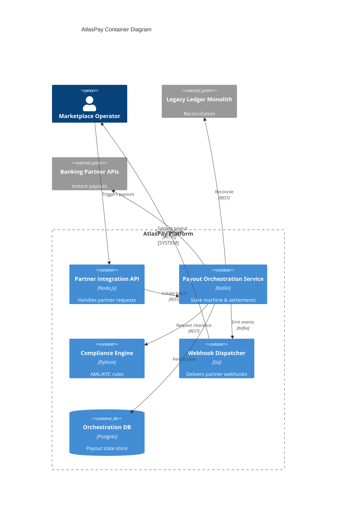
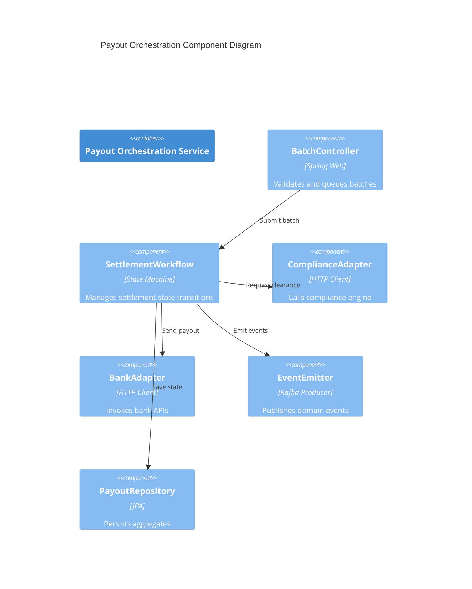
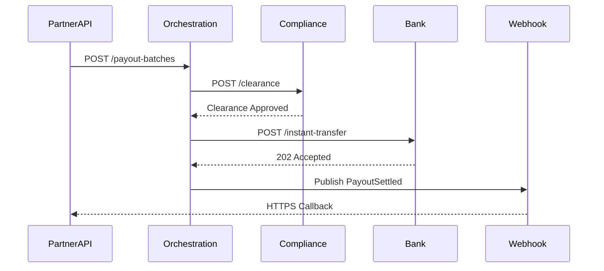

Backlinks: SDDK-TMP-DSN-0001, PRD-AtlasPay-v0.1.0.md, INIT-AtlasPay-20240515.md, CTXMAP-AtlasPay-20240515.md, GLOSSARY-Payments-v0.1.0.md

# DSN-PayoutOrchestration-20240522 Design Package

- **Runtime name**: `docs/design/DSN-PayoutOrchestration-20240522.md`
- **Purpose**: Evaluate solutions, choose architecture approaches, and break down implementation testing strategy.

## Metadata
- Context / Subsystem: AtlasPay Payout Orchestration
- Prepared by: AI Architecture Partner
- Date: 2024-05-22
- Related Artifacts: `PRD-AtlasPay-v0.1.0.md`, `INIT-AtlasPay-20240515.md`, `CTXMAP-AtlasPay-20240515.md`, `GLOSSARY-Payments-v0.1.0.md`

## Problem Statement
Deliver features F-001 through F-003 by orchestrating payout batches, enforcing compliance decisions, and notifying partners while integrating with legacy ledger and banking APIs.

## Option Analysis
| Option | Summary | Pros | Cons | Recommendation |
| --- | --- | --- | --- | --- |
| O-1 | Event-driven microservices (orchestration, compliance, webhook) communicating via Kafka | Decoupled, scalable, aligns with domain boundaries | Higher operational overhead, eventual consistency complexity | Adopt for long-term scalability |
| O-2 | Extend existing ledger monolith with payout routes | Lower infra complexity, reuse existing stack | Slows delivery, mixes domains, harder to evolve compliance | Reject due to domain entanglement |
| O-3 | Orchestration service + managed workflow (e.g. Temporal) | Strong visibility, built-in retries | Adds new operational tech, learning curve | Defer; revisit post-MVP |

## Chosen Solution
- Architecture Overview: Dedicated `atlaspay-orchestration` service coordinates payouts via asynchronous events, integrates with compliance API and banking providers, persists state in Postgres, emits events for partner notifications.
- Key Components & Responsibilities:
  - Orchestration API: accepts payout batches, validates schema.
  - Orchestration Engine: state machine managing settlement states.
  - Compliance Connector: invokes compliance engine, handles responses.
  - Banking Adapter: abstracts provider APIs with retry policies.
  - Event Publisher: emits `PayoutSettled`, `PayoutFailed` events to Kafka.
- Aggregate / Entity Model: `PayoutBatch` aggregate containing `PayoutItem` entities, settlement state transitions, audit trail entries.
- C4 Model View:
  - Level 2 (Container) Diagram:

  - Level 3 (Component) Diagram:

- Sequence Diagram (key flow):

- Additional Interaction Diagram (Mermaid or PlantUML as needed): Not Applicable (covered by C4 and sequence diagrams).

## Architecture Decisions (ADR Summary)
| Decision ID | Decision | Rationale | Status | Link |
| --- | --- | --- | --- | --- |
| ADR-PO-001 | Adopt event-driven orchestration service | Align with bounded contexts, scalability | Proposed | `docs/design/adr/ADR-PayoutOrchestration-001.md` |
| ADR-PO-002 | Store payout state in Postgres | Strong consistency, existing expertise | Proposed | `docs/design/adr/ADR-PayoutOrchestration-002.md` |

## Testing Strategy
| Test Level | Scenario | Expected Outcome | Automation? |
| --- | --- | --- | --- |
| Unit | SettlementWorkflow transitions | Valid transitions enforced | Yes |
| Integration | ComplianceAdapter with mock responses | Handles approvals & rejections | Yes |
| Contract | Webhook payload schema | Matches documented fields | Yes |
| End-to-End | Submit batch to settled state | Settles under SLA, events emitted | Yes |
| Performance | 200 concurrent batches | <500ms average response | Yes |

## Operational Considerations
- Deployment: Kubernetes with blue/green rollout, config via Helm.
- Observability: Structured logging, traces via OpenTelemetry, custom metrics for settlement time.
- Failure Modes & Mitigations: Bank API failures -> circuit breaker; compliance timeouts -> retry/backoff; DB downtime -> failover replicas.

## Task Breakdown
| Task ID | Description | Definition of Done | Related Feature | Owner |
| --- | --- | --- | --- | --- |
| T-001 | Implement BatchController API | Endpoint validates & enqueues batches, unit + integration tests pass | F-001 | Backend Squad |
| T-002 | Build SettlementWorkflow engine | State machine handles all transitions with tests | F-001 | Backend Squad |
| T-003 | Integrate ComplianceAdapter | Clearance requests & retry policy tested | F-002 | Risk Squad |
| T-004 | Deliver Webhook Dispatcher | Kafka consumer sends signed webhooks with retries | F-003 | DX Squad |
| T-005 | Author Observability dashboards | Metrics and alerts in Grafana | F-001 | SRE Squad |

## Traceability
- PRD Features Covered: F-001, F-002, F-003
- Glossary Terms Introduced/Updated: payout batch, settlement state, partner webhook
- Dependent Contexts: Compliance Engine, Legacy Ledger, Banking Partner APIs

## Open Questions & Follow-ups
| Item | Owner | Due |
| --- | --- | --- |
| Confirm bank API sandbox availability | Compliance Officer | 2024-05-25 |
| Define webhook HMAC secret rotation process | DX Squad | 2024-05-28 |

Backlinks: `SDDK-TMP-DSN-0001`
