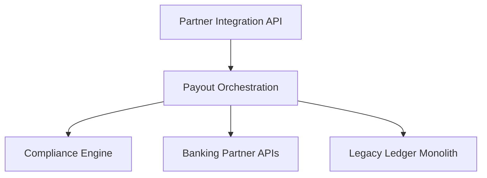

Backlinks: SDDK-TMP-CTX-0001, INIT-AtlasPay-20240515.md, GLOSSARY-Payments-v0.1.0.md

# CTXMAP-AtlasPay-20240515 Context Map

- **Runtime name**: `docs/init/CTXMAP-AtlasPay-20240515.md`
- **Purpose**: Describe bounded contexts, relationships, and integration contracts.

## Summary
AtlasPay comprises core payout orchestration, compliance checks, and partner integration contexts, integrating with an existing ledger monolith and external banking APIs.

## Bounded Contexts
| Context | Core Domain? | Responsibilities | Owner |
| --- | --- | --- | --- |
| Payout Orchestration | Yes | Manage payout batches, routing, settlement state | AtlasPay Core Team |
| Compliance Engine | Supporting | Perform KYC/AML checks, audit logging | Risk & Compliance Team |
| Partner Integration API | Supporting | Expose REST & webhook interfaces to partners | Developer Experience Team |
| Legacy Ledger Monolith | Generic | Financial accounting, reconciliations | Finance IT |
| Banking Partner APIs | Generic | Execute fund movements | External Providers |

## Relationships
| Source Context | Target Context | Relationship Type (Shared Kernel, Upstream/Downstream, etc.) | Contract |
| --- | --- | --- | --- |
| Payout Orchestration | Compliance Engine | Upstream (needs compliance clearance) | Synchronous API call with SLA 500ms |
| Payout Orchestration | Partner Integration API | Shared Kernel (domain events) | Kafka event schema `PayoutSettled` |
| Payout Orchestration | Legacy Ledger Monolith | Upstream (ledger) | REST contract `/ledger/reconcile` |
| Payout Orchestration | Banking Partner APIs | Upstream | HTTPS REST + OAuth |
| Partner Integration API | Partners | Downstream | Public REST + Webhooks |

## Integration Details
- Protocols / Interfaces: REST, Kafka events, OAuth 2.0 service accounts.
- Data Ownership: Payout orchestration owns payout states; ledger owns accounting balances; compliance owns audit logs.
- Anti-Corruption Layers: ACL between orchestration and ledger to translate ledger-specific codes.

## Diagram

## Risks & Mitigations
| Risk | Impact | Mitigation |
| --- | --- | --- |
| Legacy ledger latency | Settlement delays | Introduce async reconciliation queue |
| Compliance false positives | Blocked payouts | Provide override workflow with audit trail |
| Banking API downtimes | Failed payouts | Multi-provider routing, retry policies |

## Alignment Notes
Terminology aligns with `GLOSSARY-Payments-v0.1.0.md`. PRD features will reference orchestration states and partner API contracts.
